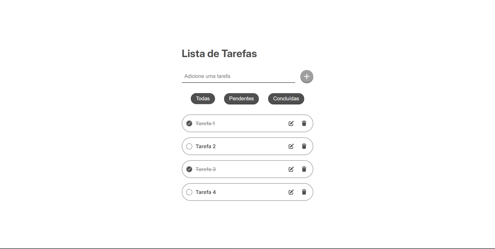

# Todo List

Aplicação de gerenciamento de tarefas desenvolvida com React, Vite e Styled Components.

## Preview



## Deploy

Acesse a aplicação:

[Link do projeto](https://todo-list-five-kappa-41.vercel.app/)

## Funcionalidades

- Criar tarefas
- Editar tarefas
- Excluir tarefas
- Marcar tarefas como concluídas
- Filtrar tarefas:
  - Todas
  - Pendentes
  - Concluídas
- Persistência de dados com Local Storage

## Tecnologias Utilizadas

- React
- Vite
- Styled Components
- JavaScript
- HTML5
- CSS3

## Como executar localmente

Clone o repositório:

```bash
git clone https://github.com/ElielSousa/todo-list.git
```

Entre na pasta:

```bash
cd todo-list
```

Instale as dependências:

```bash
npm install
```

Execute o projeto:

```bash
npm run dev
```

## Aprendizados

Durante o desenvolvimento deste projeto foram praticados conceitos como:

- Componentização
- Context API
- Manipulação de estados
- Persistência com Local Storage
- Responsividade
- Styled Components
- Boas práticas em React

## Autor

Eliel Sousa

GitHub:
https://github.com/ElielSousa
